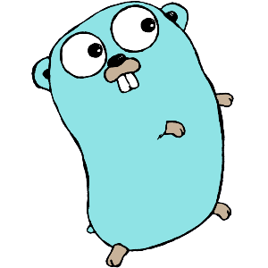

# Golang - Handbook

## Sobre o Go

Go é uma linguagem desenvolvida pelo Google e lançada em 2009 como código aberto.

## Seções

1. [Fundamentos](https://www.github.com/georgekaran/tree/master/fundamentos)
2. [Controles](https://www.github.com/georgekaran/tree/master/controles)
3. [Array/Slice/Map](https://www.github.com/georgekaran/tree/master/arrayslicemap)
4. [Funções](https://www.github.com/georgekaran/tree/master/funcoes)
5. [Tipos](https://www.github.com/georgekaran/tree/master/tipos)
6. [Pacotes](https://www.github.com/georgekaran/tree/master/pacote)
6. [Concorrência](https://www.github.com/georgekaran/tree/master/concorrencia)